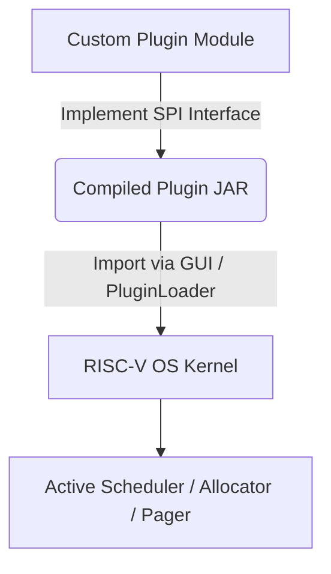

# RISC-V 32 OS Simulator: Custom Library & Plugin Development Guide

This guide details how to set up your local development environment to write, compile, and hot-swap custom OS components—specifically **Task Management (Schedulers)**, **Contiguous Memory Allocators**, and **Paged Virtual Memory Replacement Policies**—using Java Service Provider Interface (SPI) plugins.

---

## 1. Overview & Architecture

The simulator kernel relies on [PluginLoader.java](file:///g:/RISCV32_Final_V2/RISCV32_TestOldFork/app/src/main/java/cse311/kernel/plugin/PluginLoader.java) to load custom `.jar` binary libraries dynamically at runtime using Java standard `java.util.ServiceLoader` (SPI).



### Extension Points Overview

| Subsystem             | Extension Point Interface / Abstract Class             | Mandatory SPI File Name                                |
| :-------------------- | :----------------------------------------------------- | :----------------------------------------------------- |
| **Task Management**   | `cse311.kernel.scheduler.Scheduler`                    | `cse311.kernel.scheduler.Scheduler`                    |
| **Contiguous Memory** | `cse311.kernel.contiguous.AllocationStrategy`          | `cse311.kernel.contiguous.AllocationStrategy`          |
| **Page Replacement**  | `cse311.kernel.NonContiguous.paging.ReplacementPolicy` | `cse311.kernel.NonContiguous.paging.ReplacementPolicy` |

---

## 2. Local Development Environment Setup

### Prerequisites

- **JDK:** Java 17 or higher [Java JDK Download](https://www.azul.com/downloads/?package=jdk#zulu), [JDK Set Up](https://docs.oracle.com/cd/F74770_01/English/Installing/p6_eppm_install_config/89522.htm)
- **Build Tool:** Gradle 8.x (using included `./gradlew`)

### Development Environment Options

You can build custom plugins using two approaches:

1. **Option 1: In-Tree Module** (inside this repository under `example-plugins/`)
2. **Option 2: Standalone External Gradle Project** (an independent repository/folder outside the simulator repo)

---

### Option 1: In-Tree Setup (`example-plugins`)

If developing directly inside the simulator workspace:

#### Directory Structure

```text
example-plugins/
├── build.gradle
└── src/
    └── main/
        ├── java/
        │   └── cse311/
        │       └── example/
        │           ├── CustomScheduler.java
        │           ├── CustomAllocator.java
        │           └── CustomReplacementPolicy.java
        └── resources/
            └── META-INF/
                └── services/
                    ├── cse311.kernel.scheduler.Scheduler
                    ├── cse311.kernel.contiguous.AllocationStrategy
                    └── cse311.kernel.NonContiguous.paging.ReplacementPolicy
```

#### `settings.gradle` (Root Repository)

Ensure `settings.gradle` in the root workspace includes the `example-plugins` subproject:

```groovy
rootProject.name = 'CSE311'
include('app')
include('example-plugins')
```

#### `example-plugins/build.gradle`

```groovy
plugins {
    id 'java-library'
}

java {
    toolchain {
        languageVersion = JavaLanguageVersion.of(17)
    }
}

dependencies {
    compileOnly project(':app')
}
```

---

### Option 2: Standalone External Gradle Project Setup (Step-by-Step)

To build a standalone plugin in a completely separate project directory or repository:

#### Step 1: Create Project Folder & Directory Hierarchy

Open a terminal and run:

```bash
# Create project folder
mkdir my-os-plugin
cd my-os-plugin

# Create directory structure
mkdir -p libs
mkdir -p src/main/java/com/mycompany/os
mkdir -p src/main/resources/META-INF/services
```

#### Step 2: Obtain the Simulator API Dependency (`app.jar`)

Build the simulator core JAR in the main repository:

```bash
./gradlew :app:jar
```

Copy `app/build/libs/app.jar` from the main repository into the `libs/` folder of your standalone `my-os-plugin` project:

```text
my-os-plugin/
└── libs/
    └── app.jar
```

#### Step 3: Create `settings.gradle`

Create `my-os-plugin/settings.gradle`:

```groovy
rootProject.name = 'my-os-plugin'
```

#### Step 4: Create `build.gradle`

Create `my-os-plugin/build.gradle`:

```groovy
plugins {
    id 'java-library'
}

java {
    toolchain {
        languageVersion = JavaLanguageVersion.of(17)
    }
}

repositories {
    mavenCentral()
}

dependencies {
    // Compile against the simulator API JAR stored in libs/
    compileOnly files('libs/app.jar')
}

jar {
    archiveBaseName = 'my-os-plugin'
    archiveVersion = '1.0.0'
}
```

#### Step 5: Initialize Gradle Wrapper (Optional but Recommended)

Initialize the Gradle wrapper in your standalone folder:

```bash
gradle wrapper --gradle-version 8.5
```

#### Step 6: Create Implementation & Service Registration Files

1. Add your Java implementation file to `src/main/java/com/mycompany/os/MyCustomScheduler.java`.
2. Add your SPI declaration file to `src/main/resources/META-INF/services/cse311.kernel.scheduler.Scheduler` containing:
   ```text
   com.mycompany.os.MyCustomScheduler
   ```

#### Step 7: Compile Standalone JAR

Run the build command inside `my-os-plugin`:

```bash
./gradlew jar
```

The compiled plugin JAR will be produced at:
`my-os-plugin/build/libs/my-os-plugin-1.0.0.jar`

---

---

## 3. Writing Custom OS Modules

### A. Task Management (Custom Scheduler)

To create a custom process/task scheduler, extend [Scheduler.java](file:///g:/RISCV32_Final_V2/RISCV32_TestOldFork/app/src/main/java/cse311/kernel/scheduler/Scheduler.java):

```java
package com.custom.os;

import cse311.kernel.process.Task;
import cse311.kernel.process.TaskState;
import cse311.kernel.scheduler.Scheduler;
import java.util.LinkedList;
import java.util.Queue;

public class CustomPriorityScheduler extends Scheduler {
    private final Queue<Task> readyQueue = new LinkedList<>();

    // Protected no-arg constructor required for Java SPI
    public CustomPriorityScheduler() {
        super();
    }

    @Override
    public Task schedule() {
        return readyQueue.poll();
    }

    @Override
    public void addTask(Task task) {
        if (task.getState() == TaskState.READY && !readyQueue.contains(task)) {
            readyQueue.offer(task);
        }
    }

    @Override
    public void removeTask(Task task) {
        readyQueue.remove(task);
    }
}
```

**SPI Registration:** Create the file `src/main/resources/META-INF/services/cse311.kernel.scheduler.Scheduler` containing:

```text
com.custom.os.CustomPriorityScheduler
```

---

### B. Contiguous Memory Management (Custom Memory Allocator)

To write custom allocation policies (e.g. Next-Fit, Best-Fit, Random-Fit), implement [AllocationStrategy.java](file:///g:/RISCV32_Final_V2/RISCV32_TestOldFork/app/src/main/java/cse311/kernel/contiguous/AllocationStrategy.java). Refer to [RandomFitAllocator.java](file:///g:/RISCV32_Final_V2/RISCV32_TestOldFork/example-plugins/src/main/java/cse311/example/RandomFitAllocator.java) for reference:

```java
package com.custom.os;

import cse311.kernel.contiguous.AllocationStrategy;
import cse311.kernel.contiguous.MemoryBlock;
import java.util.List;

public class BestFitAllocator implements AllocationStrategy {

    @Override
    public int findRegion(List<MemoryBlock> holes, int requestSize) {
        if (holes == null || holes.isEmpty() || requestSize <= 0) {
            return -1;
        }

        int bestAddress = -1;
        int minHoleSize = Integer.MAX_VALUE;

        for (MemoryBlock hole : holes) {
            if (hole != null && hole.size >= requestSize && hole.size < minHoleSize) {
                minHoleSize = hole.size;
                bestAddress = hole.start;
            }
        }
        return bestAddress;
    }
}
```

**SPI Registration:** Create the file `src/main/resources/META-INF/services/cse311.kernel.contiguous.AllocationStrategy` containing:

```text
com.custom.os.BestFitAllocator
```

---

### C. Virtual Memory Management (Custom Page Replacement Policy)

To implement custom page eviction algorithms (e.g., LFU, Second-Chance, Optimal), implement [ReplacementPolicy.java](file:///g:/RISCV32_Final_V2/RISCV32_TestOldFork/app/src/main/java/cse311/kernel/NonContiguous/paging/ReplacementPolicy.java):

```java
package com.custom.os;

import cse311.kernel.NonContiguous.paging.ReplacementPolicy;
import java.util.BitSet;
import java.util.function.IntPredicate;

public class CustomLRUReplacementPolicy implements ReplacementPolicy {
    private final long[] lastAccessTime = new long[1024];
    private long counter = 0;

    @Override
    public void onAccess(int frameIndex) {
        if (frameIndex >= 0 && frameIndex < 1024) {
            lastAccessTime[frameIndex] = ++counter;
        }
    }

    @Override
    public void onMap(int frameIndex) {
        onAccess(frameIndex);
    }

    @Override
    public void onUnmap(int frameIndex) {
        if (frameIndex >= 0 && frameIndex < 1024) {
            lastAccessTime[frameIndex] = 0;
        }
    }

    @Override
    public int pickVictim(IntPredicate canEvict) {
        int victimIndex = -1;
        long minTime = Long.MAX_VALUE;

        for (int i = 0; i < 1024; i++) {
            if (canEvict.test(i) && lastAccessTime[i] < minTime) {
                minTime = lastAccessTime[i];
                victimIndex = i;
            }
        }
        return victimIndex;
    }
}
```

**SPI Registration:** Create the file `src/main/resources/META-INF/services/cse311.kernel.NonContiguous.paging.ReplacementPolicy` containing:

```text
com.custom.os.CustomLRUReplacementPolicy
```

---

## 4. Building the Plugin JAR

Build the plugin binary by executing Gradle from the repository root:

```bash
# Build example-plugins submodule
./gradlew :example-plugins:jar
```

Or on Windows:

```powershell
.\gradlew.bat :example-plugins:jar
```

The resulting compiled library file will be located at:
`example-plugins/build/libs/example-plugins.jar`

---

## 5. Loading & Hot-Swapping into the Dev Simulator Environment

Once compiled, load your library directly into the active simulator environment via the GUI or code API.

### Option A: Using the Graphical User Interface (GUI)

As integrated in [MainController.java](file:///g:/RISCV32_Final_V2/RISCV32_TestOldFork/app/src/main/java/cse311/gui/MainController.java):

1. **Import Custom Scheduler**:
   - Navigate to the **Task Management / Control Panel** toolbar.
   - Click **Import Scheduler**.
   - Pick your compiled `.jar` file. The simulator will validate and activate the plugin dynamically.

2. **Import Memory Allocator**:
   - Ensure simulator memory mode is set to **Contiguous**.
   - Click **Import Memory Allocator**.
   - Select your custom allocator `.jar`.

3. **Import Page Replacement Policy**:
   - Ensure simulator memory mode is set to **Paging**.
   - Click **Import Page Replacement**.
   - Select your custom page replacement policy `.jar`.

### Option B: Programmatic Loading API

You can also programmatically load plugins inside your unit tests or custom bootstrap scripts using [PluginLoader.java](file:///g:/RISCV32_Final_V2/RISCV32_TestOldFork/app/src/main/java/cse311/kernel/plugin/PluginLoader.java):

```java
File jarFile = new File("path/to/plugin.jar");

// Load custom scheduler
Scheduler customScheduler = PluginLoader.loadCustomScheduler(jarFile);
kernel.setScheduler(customScheduler);

// Load custom memory allocator
AllocationStrategy customAllocator = PluginLoader.loadCustomAllocator(jarFile);
((ContiguousMemoryManager) kernel.getMemory()).setAllocationStrategy(customAllocator);

// Load custom page replacement policy
ReplacementPolicy customPolicy = PluginLoader.loadCustomReplacementPolicy(jarFile);
DemandPager pager = new DemandPager((PagedMemoryManager) kernel.getMemory(), customPolicy);
((PagedMemoryManager) kernel.getMemory()).setPager(pager);
```

---

## 6. Debugging & Verification Checklist

- [ ] **No-Arg Constructor**: Ensure your custom class has a public or protected no-argument constructor (required by Java SPI).
- [ ] **Package & Class Name**: Ensure the text inside `META-INF/services/<Interface>` matches the exact fully-qualified class name.
- [ ] **Classpath Visibility**: Plugin classes should import core contracts from `cse311.kernel.*`.
- [ ] **Hot-Swapping Log**: Check console output for `PluginLoader: Loaded <Interface> implementation: <ClassName>` to verify successful activation.
