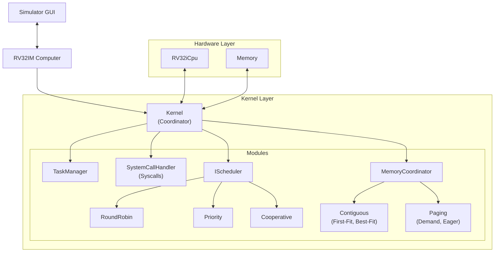

# RV32IM System Simulator & Kernel

A modular, extensible kernel implementation and simulator for the RV32IM CPU architecture, written in Java. This project provides a full-featured simulation environment, including a GUI, pluggable kernel subsystems, and real-time visualization of CPU state, memory, and scheduling.

## 🚀 Key Features

### 1. **Modular Architecture**
The system uses a pluggable interface design, allowing instant swapping of core components:
-   **Memory Management**: Switch between **Contiguous** (First-Fit, Best-Fit) and **Paging** (Demand, Eager, LRU/Clock) modes at boot time.
-   **Scheduling**: Built-in support for **Round Robin**, **Priority**, and **Cooperative** schedulers.

### 2. **Advanced GUI Visualization**
State-of-the-art visualization tools for debugging and understanding OS concepts:
-   **CPU View**: Real-time inspection of 32 general-purpose registers and Program Counter.
-   **Assembly View**: **Integrated Disassembler** (RV32I + M-extensions) shows the running instruction stream in human-readable assembly. Optimized for performance and usability.
-   **Memory View**: Visual tape (Contiguous) or Page Table Grid (Paging) showing real-time allocations, fragmentation, and page faults.
-   **Scheduler View**: Live queues for Ready, I/O Wait, and Sleep states.
-   **Terminal**: Simulated UART console for user interactivity.

### 3. **Concurrency & Safety**
-   **Race Condition Free**: Rigorously tested schedulers with atomic task queue management.
-   **Double Schedule Detector**: A built-in kernel "trap" that detects if a task is ever scheduled on multiple cores simultaneously, immediately halting the system to prevent undefined behavior.

### 4. **Process Management**
-   Full Unix-style process hierarchy (Parent/Child).
-   `fork()`, `exec()`, `wait()`, `exit()` generic implementation.
-   Zombie reaping and orphan adoption by Init (PID 1).

---

## 🛠️ Build & Run

This project uses **Gradle** (incompatible with Gradle < 8.0, supports Gradle 9.0+).

### Prerequisites
-   Java JDK 17 or higher.

### Command Line
```bash
# Clean and Build
./gradlew clean build

# Run the Simulator
./gradlew run
```

---

## 📚 Configuration & Swapping Algorithms

The kernel is designed for experimentation. You can easily swap algorithms by modifying **`RV32Computer.java`** and **`App.java`**.

### 1. Changing Memory Strategies
Open `app/src/main/java/cse311/RV32Computer.java` to configure memory policies:

**For Contiguous Memory:**
```java
// Swapping Allocation Algorithms is a one-line change:
AllocationStrategy allocator = new BestFitStrategy(); 
// AllocationStrategy allocator = new FirstFitStrategy(); // to switch, just uncomment this!
```

**For Paging:**
```java
// Configure Paging Policies (Fetch & Replacement)
PagingConfiguration.configure(pmm,
        PagingConfiguration.Policy.DEMAND, // or EAGER
        PagingConfiguration.Policy.CLOCK   // or LRU, RANDOM
);
```

### 2. Changing Schedulers
Open `app/src/main/java/cse311/App.java` to select the CPU scheduler:

```java
// Use Round Robin (Time Sliced)
kernel.getConfig().setSchedulerType(KernelConfig.SchedulerType.ROUND_ROBIN);

// Or switch to Priority / Cooperative
// kernel.getConfig().setSchedulerType(KernelConfig.SchedulerType.PRIORITY);
```

---

## 🖥️ System Architecture



---

## 🔌 Extending the Kernel

### 1. Implementing a New Scheduler
To add a new scheduling algorithm (e.g., "Lottery Scheduling"), extend the `Scheduler` class:

```java
public class LotteryScheduler extends Scheduler {
    private Random random = new Random();

    public LotteryScheduler(int timeSlice) {
        super(timeSlice);
    }

    @Override
    public Task schedule(Collection<Task> tasks) {
        // Atomic thread-safe queue access is handled by base class
        List<Task> readyTasks = getReadyTasks();
        if (readyTasks.isEmpty()) return null;
        return readyTasks.get(random.nextInt(readyTasks.size()));
    }
}
```

### 2. Adding System Calls
New system calls can be registered in `SystemCallHandler.java`. The kernel currently supports:

| Syscall | Code | Description |
| :--- | :--- | :--- |
| `SYS_EXIT` | 93 | Terminate process |
| `SYS_READ` | 63 | Read from UART |
| `SYS_WRITE` | 64 | Write to UART |
| `SYS_YIELD` | 124 | Yield CPU |
| `SYS_FORK` | 220 | Clone process |
| `SYS_EXEC` | 221 | Load ELF program |
| `SYS_WAIT` | 260 | Wait for child exit |
| `SYS_SLEEP` | 1002 | Sleep for N milliseconds |
| `SYS_DEBUG_PRINT`| 1000 | Print to Host Console |

---

## 🐛 Debugging Features

-   **Disassembler**: Use the detailed view to trace instructions `pc - 15` to `pc + 15`.
-   **Panic Mode**: If the kernel detects an invalid state (e.g. Double Schedule), it throws a `RuntimeException` to stop execution immediately.