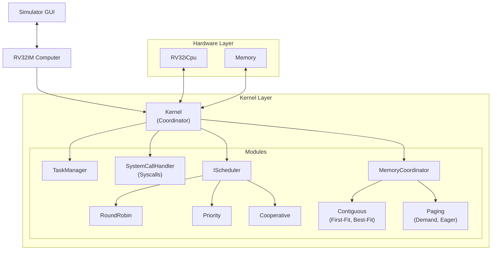

# RV32IM System Simulator & Kernel

A modular, extensible kernel implementation and simulator for the RV32IM CPU architecture, written in Java. This project provides a full-featured simulation environment, including a GUI, pluggable kernel subsystems, and real-time visualization of CPU state, memory, and scheduling.

## 🚀 Key Features

### 1. **Modular Architecture**

The system uses a pluggable interface design, allowing instant swapping of core components:

- **Memory Management**: Switch between **Contiguous** (First-Fit, Best-Fit) and **Paging** (Demand, Eager, LRU/Clock) modes at boot time.
- **Scheduling**: Built-in support for **Round Robin**, **Priority**, and **Cooperative** schedulers.
- **Multi-Core SMP**: Default configuration supports **5 CPU cores** with proper bootstrap processor (BSP) and application processor (AP) coordination.

### 2. **Advanced GUI Visualization**

State-of-the-art visualization tools for debugging and understanding OS concepts:

- **CPU View**: Real-time inspection of 32 general-purpose registers and Program Counter.
- **Assembly View**: **Integrated Disassembler** (RV32I + M-extension + A-extension + C-extension) shows the running instruction stream in human-readable assembly. Optimized for performance and usability.
- **Memory View**: Visual tape (Contiguous) or Page Table Grid (Paging) showing real-time allocations, fragmentation, and page faults.
- **Scheduler View**: Live queues for Ready, I/O Wait, Sleep, and Condition Variable states.
- **Terminal**: Simulated UART console for user interactivity.
- **Datapath View**: Animated CPU datapath showing real-time data flow, control signals, and component activity.

### 3. **Concurrency & Safety**

- **Race Condition Free**: Rigorously tested schedulers with atomic task queue management using `Spinlock` synchronization.
- **Double Schedule Detector**: A built-in kernel "trap" that detects if a task is ever scheduled on multiple cores simultaneously, immediately halting the system to prevent undefined behavior.
- **Hardware Atomic Instructions**: Full RV32A extension support with LR/SC and AMO instructions for user-space mutexes and spinlocks.
- **Thread Support**: POSIX-style threads with `clone()`, mutex locks, and condition variables.

### 4. **Process Management**

- Full Unix-style process hierarchy (Parent/Child).
- `clone()`, `fork()`, `exec()`, `wait()`, `exit()` implementation (using Linux `clone()` syscall as the unified primitive).
- Zombie reaping and orphan adoption by Init (PID 1).
- Shared memory support via `CLONE_VM` flag for threads vs processes distinction.

---

## 🛠️ Build & Run

This project uses **Gradle** (incompatible with Gradle < 8.0, supports Gradle 9.0+).

### Prerequisites

- Java JDK 17 or higher.

### Command Line

```bash
# Clean and Build
./gradlew clean build

# Run the Simulator
./gradlew run

# Debugging
./gradlew run --debug-jvm
```

---

## 📚 Configuration & Swapping Algorithms

Please take a look at [Plugin & Library Loading Guide](file:///g:/RISCV32_Final_V2/RISCV32_TestOldFork/PLUGIN_DEVELOPMENT_GUIDE.md)

---

## 🖥️ System Architecture


```mermaid
flowchart TD
    A[Simulator GUI] <--> B[RV32IM Computer]

    subgraph "Hardware Layer"
        H1[RV32iCpu]
        H2[Memory]
    end

    subgraph "Kernel Layer"
        K1["Kernel\n(Coordinator)"]

        subgraph Modules
            TM[TaskManager]
            SYSCALL["SystemCallHandler\n(Syscalls)"]
            SCH[IScheduler]
            SCHRR[RoundRobin]
            SCHPR[Priority]
            SCHCO[Cooperative]
            MC[MemoryCoordinator]
            MC1["Contiguous\n(First-Fit, Best-Fit)"]
            MC2["Paging\n(Demand, Eager)"]
        end
    end

    B --> K1
    H1 <--> K1
    H2 <--> K1

    K1 --> TM & SYSCALL & SCH & MC

    SCH --> SCHRR & SCHPR & SCHCO
    MC --> MC1 & MC2
```

---

## 🔌 Extending the Kernel

### 1. Implementing a New Scheduler

To add a new scheduling algorithm (e.g., "Lottery Scheduling"), extend the `Scheduler` class:

```java
public class LotteryScheduler extends Scheduler {
    private Random random = new Random();

    public LotteryScheduler(int timeSlice) {
        super(timeSlice);
    }

    @Override
    public Task schedule(Collection<Task> tasks) {
        // Atomic thread-safe queue access is handled by base class
        List<Task> readyTasks = getReadyTasks();
        if (readyTasks.isEmpty()) return null;
        return readyTasks.get(random.nextInt(readyTasks.size()));
    }
}
```

### 2. Adding System Calls

New system calls can be registered in `SystemCallHandler.java`. The kernel currently supports:

| Syscall            | Code | Description                               |
| :----------------- | :--- | :---------------------------------------- |
| `SYS_EXIT`         | 93   | Terminate process                         |
| `SYS_READ`         | 63   | Read from file descriptor                 |
| `SYS_WRITE`        | 64   | Write to file descriptor                  |
| `SYS_YIELD`        | 124  | Yield CPU to scheduler                    |
| `SYS_GETPID`       | 172  | Get process ID                            |
| `SYS_CLONE`        | 220  | Create thread/process (unified primitive) |
| `SYS_EXEC`         | 221  | Load and execute ELF program              |
| `SYS_WAIT`         | 260  | Wait for child exit                       |
| `SYS_KILL`         | 129  | Send signal to process                    |
| `SYS_NANOSLEEP`    | 101  | High-resolution sleep                     |
| `SYS_DEBUG_PRINT`  | 1000 | Print to host console                     |
| `SYS_GET_TIME`     | 1001 | Get system time                           |
| `SYS_OPEN`         | 56   | Open file                                 |
| `SYS_CLOSE`        | 57   | Close file descriptor                     |
| `SYS_DUP`          | 23   | Duplicate file descriptor                 |
| `SYS_PIPE`         | 59   | Create pipe for IPC                       |
| `SYS_FSTAT`        | 80   | Get file status                           |
| `SYS_MKNOD`        | 33   | Create device node                        |
| `SYS_MKDIR`        | 34   | Create directory                          |
| `SYS_UNLINK`       | 35   | Delete file                               |
| `SYS_LINK`         | 37   | Create hard link                          |
| `SYS_CHDIR`        | 49   | Change directory                          |
| `SYS_CV_WAIT`      | 280  | Condition variable wait                   |
| `SYS_CV_SIGNAL`    | 281  | Condition variable signal                 |
| `SYS_CV_BROADCAST` | 282  | Condition variable broadcast              |

---

## 🐛 Debugging Features

- **Disassembler**: Use the detailed view to trace instructions `pc - 15` to `pc + 15`.
- **Panic Mode**: If the kernel detects an invalid state (e.g. Double Schedule), it throws a `RuntimeException` to stop execution immediately.
- **File Logger**: All kernel events, errors, and debug information logged to file for post-mortem analysis.
- **Visual Breakpoints**: GUI allows stepping through execution, inspecting registers, memory, and scheduler state in real-time.
- **CSR Debugging**: Control and Status Register inspection for privilege mode and interrupt configuration.

---

## 📋 ISA Support

The simulator implements the following RISC-V ISA extensions:

- **RV32I**: Base integer instruction set (40 instructions)
- **RV32M**: Multiply/Divide extension (MUL, MULH, DIV, REM, etc.)
- **RV32A**: Atomic extension (LR, SC, AMOSWAP, AMOADD, etc.) - **Used by C library for mutexes**
- **RVC**: Compressed instruction extension (16-bit instructions)
- **Zicsr**: Control and Status Register access (CSRRW, CSRRS, MRET, SRET) - **Emulated by CPU** for exception handling and privilege mode switching (user programs access via ECALL only, not direct CSR instructions)

---

## 🔄 Inter-Process Communication (IPC)

The kernel provides comprehensive IPC mechanisms for process coordination and data sharing:

### **1. Pipes** (Byte-stream Communication)

- **System Call**: `SYS_PIPE (59)`
- **Implementation**: 4KB circular buffer with blocking read/write semantics
- **Features**:
  - Creates two file descriptors (read end, write end)
  - Automatic task blocking when pipe is full (writers) or empty (readers)
  - Broken pipe detection when read/write end closes
  - Integration with file descriptor system
- **Use Case**: Parent-child communication, producer-consumer patterns

### **2. Condition Variables** (Synchronization)

- **System Calls**: `SYS_CV_WAIT (280)`, `SYS_CV_SIGNAL (281)`, `SYS_CV_BROADCAST (282)`
- **Features**:
  - Per-CV wait queues with signal/broadcast semantics
  - Integration with user-space mutexes for monitor pattern
  - Automatic cleanup when no waiters remain
- **Use Case**: Thread synchronization, event signaling

### **3. Shared Memory** (High-performance Data Sharing)

- **System Calls**: `SYS_SHM_OPEN (20)`, `SYS_SHM_ATTACH (21)`
- **Implementation**: Key-based frame allocation with reference counting
- **Features**:
  - Virtual memory mapping to shared physical frames
  - Write permission control per mapping
  - Automatic cleanup via reference counting
  - **Available in**: Paging mode only
- **Use Case**: High-throughput data sharing, shared buffers

### **4. Thread Creation** (Shared Address Space)

- **System Call**: `SYS_CLONE (220)` (Linux-style)
- **Clone Flags**:
  - `CLONE_VM (0x00000100)` - Share memory space (creates threads)
  - `CLONE_FILES (0x00000400)` - Share file descriptors
  - `CLONE_SIGHAND (0x00000800)` - Share signal handlers
- **Features**:
  - True POSIX-style thread creation
  - Proper parent-child relationship tracking
  - Resource sharing control via flags
- **Use Case**: Multi-threaded applications, parallel processing

### **5. File Descriptor Inheritance** (Implicit IPC)

- **Mechanism**: Via `clone()` with `CLONE_FILES` flag
- **Features**:
  - Child inherits parent's file descriptor table
  - Shared access to pipes, files, and devices
  - Reference-counted file descriptor management
- **Use Case**: Process cooperation, resource sharing

### **6. User-space Mutexes** (Synchronization)

- **Implementation**: C library using RV32A atomic instructions
- **Features**:
  - Spinlock implementation using LR/SC instructions
  - Integration with condition variables
  - Thread-safe across multiple CPU cores
- **Use Case**: Critical section protection, resource locking
